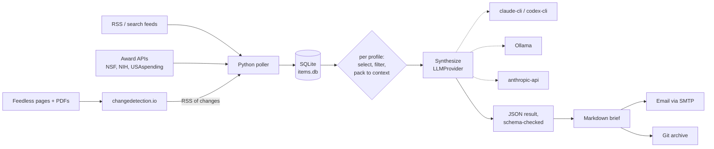

# Topic Brief — Build Spec

2026-09-16 · Andrew Severin · bioinformatics facility

## Purpose and scope

The brief is a weekly, one-page digest of public activity on a chosen topic, for a chosen audience. The system is a pipeline plus a set of **profiles**. A profile says what the topic is, which sources to watch, how to decide relevance, how to organize the page, and who receives it. The pipeline is the same for every profile.

The first profile is **AI at ISU**: who got funded for what, new hires, new centers or initiatives, and new policy at Iowa State, delivered Monday mornings to the VPR office and department chairs who opt in. Later profiles are expected to be other campus topics (quantum, ag data, cybersecurity) and per-faculty briefs (one researcher's field: papers, funding calls, competitor awards).

In scope: public sources only (news pages, award databases, published agendas, preprint and literature feeds). Out of scope for v1: internal-only sources (Workday, grants office feeds), anything behind a login, sentiment or editorializing, a web UI. The pipeline runs unattended. The LLM is reached through a pluggable provider: a coding CLI you are already signed in to (`claude`, `codex`), a local Ollama server, or a metered API. On the subscription CLIs or Ollama the marginal LLM cost is zero; on an API it must stay under $20/month across all profiles.

Success looks like, for the first profile: the VPR office forwards the brief rather than asking someone to compile it; chairs learn about awards in their own college from us before they hear it internally. For the system: a second profile ships with a new YAML file and zero code changes, and switching the LLM provider is one config line.

## The profile is the unit of configuration

Everything topic-specific lives in one file, `profiles/<name>.yaml`. The pipeline reads a profile and does the same three things for each one. Nothing about Iowa State, AI, or the VPR office appears in code.

```yaml
# profiles/isu-ai.yaml
name: isu-ai
title: "AI at ISU"
cadence: weekly                 # v1 supports weekly only; the field exists so daily can be added
audience: "the VPR office and department chairs at Iowa State University"
persona: "analyst for a university research office"

sources:                        # names from sources.yaml, plus optional per-profile overrides
  - inside_isu
  - isu_research_news
  - isu_news_service
  - changedetection             # all changedetection.io watches arrive on one feed
  - nsf: {awardee: "Iowa State University"}
  - nih: {org_names: ["IOWA STATE UNIVERSITY"]}
  - usaspending: {recipient: "IOWA STATE UNIVERSITY"}

relevance:
  any_of: [AI, artificial intelligence, machine learning, LLM, foundation model, data science, TrAC, AIIRA]
  none_of: []                   # hard excludes, e.g. student club events
  max_items: 80                 # upper bound; the provider's context window is the binding limit

buckets:                        # fixed order in the output
  - {name: Funding, ask: "awards, grants, gifts; include sponsor, PI, and amount verbatim"}
  - {name: People, ask: "hires, departures, named chairs, major awards to individuals"}
  - {name: Centers and initiatives, ask: "new centers, institutes, programs, partnerships"}
  - {name: Policy, ask: "university, Regents, state, or federal policy that affects AI work at ISU"}
extra_rules: []                 # appended to the base prompt rules, one string each

delivery:
  from: "brief@facility.iastate.edu"
  to: ["andrew@iastate.edu"]    # start with yourself; widen by editing this list
  subject: "{title} — week of {week_start} ({n} items)"

llm:                            # optional; overrides the global llm block in config.yaml
  provider: claude-cli
```

A per-faculty profile uses the same shape with different sources and buckets. The award adapters accept a text query instead of an institution, and literature feeds join the source list:

```yaml
# profiles/maize-genomics.yaml  (illustrative)
name: maize-genomics
title: "Maize genomics weekly"
audience: "one PI and their lab"
persona: "research assistant tracking a field for a principal investigator"
sources:
  - pubmed_search: {query: "maize[Title] AND (genome OR GWAS OR pangenome)"}   # PubMed saved-search RSS
  - biorxiv_plant_biology                                                     # subject RSS, filtered by keywords
  - nsf: {keyword: "maize genom*"}
  - nih: {advanced_text_search: "maize genome"}
  - nih_guide                                                                  # funding opportunities RSS
  - grants_gov: {category: agriculture}
relevance:
  any_of: [maize, Zea mays, corn genome]
  none_of: [sweet corn recipe]
  max_items: 60
buckets:
  - {name: Papers and preprints, ask: "new results; one line each with the main finding"}
  - {name: Funding opportunities, ask: "open calls with deadlines; include the deadline verbatim"}
  - {name: Awards in the field, ask: "who got funded for what, anywhere"}
delivery: {from: "brief@facility.iastate.edu", to: ["pi@iastate.edu"]}
llm: {provider: local, model: qwen3:8b}   # a lab's own GPU box; nothing leaves the building
```

Rules for profiles:

- **Adding a profile is a YAML file, not a code change.** That is the acceptance test for the abstraction. If a new profile needs an adapter that does not exist, the adapter is a new file in `sources/` and is then available to every profile.
- **Profiles select sources; they do not own them.** Sources are defined once in `sources.yaml` and fetched once, however many profiles use them. Two profiles watching Inside Iowa State cost one fetch.
- **Relevance is decided per profile, downstream.** Ingest stores everything a source yields. The `relevance` block and the LLM decide what makes each brief. Widening a topic never requires refetching.
- **Cost scales with profiles, not sources.** One LLM call per profile per week, with an input bounded by the provider's context window. Adding sources is free at synthesis time.
- **The provider is a profile choice too.** A campus brief the VPR forwards can run on Claude; a faculty brief can run on the lab's Ollama box. Same pipeline, same prompt, same schema check.

## Architecture overview

Three loosely coupled layers, each replaceable on its own. Ingest is shared: it turns every enabled source into rows in one SQLite table. Synthesize and deliver run once per profile.



changedetection.io is the only third-party service you run (Ollama is a second, optional one); everything else is one Python package (`brief`) with four CLI entry points:

```
brief ingest                       # all sources referenced by any enabled profile
brief synthesize --profile isu-ai  # or --all
brief deliver    --profile isu-ai  # or --all
brief doctor                       # provider availability and status, per profile
```

The first three are idempotent, so a rerun after a failure never double-counts or double-sends.

Design rules: no framework (no Airflow, no LangChain); every source adapter is one file that returns a list of `Item` dataclasses; the LLM is called exactly once per profile per week with a bounded input, never per-item; the model is asked for JSON and the pipeline validates it and renders Markdown, so the citation rule is enforced by code, not by asking nicely; the synthesis module talks to an `LLMProvider` Protocol and never to a vendor SDK directly.

## Sources

Every source is fetched one of three ways: native RSS, a public API, or changedetection.io watching a page. Sources are declared in `sources.yaml` with a `kind` naming the adapter and adapter-specific parameters. Profiles reference them by name and may override parameters inline (the award APIs are the usual case: same adapter, different filter per profile).

```yaml
# sources.yaml
inside_isu:          {kind: rss, url: "https://www.inside.iastate.edu/...", verify: true}
isu_research_news:   {kind: rss, url: "...", verify: true}
isu_news_service:    {kind: rss, url: "...", verify: true}
changedetection:     {kind: rss, url: "http://changedetection:5000/rss?token=${CD_TOKEN}"}
biorxiv_plant_biology: {kind: rss, url: "https://connect.biorxiv.org/biorxiv_xml/plant_biology"}
nih_guide:           {kind: rss, url: "https://grants.nih.gov/grants/guide/newsfeed/fundingopps.xml"}
pubmed_search:       {kind: pubmed, ...}       # builds the saved-search RSS URL from `query`
nsf:                 {kind: nsf}               # awardee | keyword | pi_name set by the profile
nih:                 {kind: nih}               # org_names | advanced_text_search set by the profile
usaspending:         {kind: usaspending}       # recipient set by the profile
grants_gov:          {kind: grants_gov}        # category | keyword set by the profile
```

### Adapter kinds

| Kind | Fetches | Parameters | Notes |
| --- | --- | --- | --- |
| `rss` | any feed, including changedetection.io's | `url` | `feedparser`; browser-like User-Agent; honors `ETag`/`Last-Modified` |
| `pubmed` | PubMed saved-search RSS | `query` | Public, no login; the query string becomes the feed URL |
| `nsf` | NSF Award Search API | `awardee`, `keyword`, `pi_name`, date range | JSON GET; keyword search covers abstracts |
| `nih` | NIH RePORTER API v2 | `org_names`, `advanced_text_search`, `project_start_date` | POST JSON |
| `usaspending` | USAspending.gov | `recipient`, `time_period` | Only federal source covering NIFA; lags weeks |
| `grants_gov` | Grants.gov opportunities | `category`, `keyword` | Phase 3+; verify the search API shape |
| changedetection.io | feedless pages, PDFs | one watch per page, configured in its UI | Arrives via the `rss` adapter, so the poller never talks to its API |

Award adapters take **either** an institution filter **or** a text filter, so the same file serves a campus profile ("everything to ISU") and a field profile ("everything about maize genomics, anywhere"). Each adapter exposes `fetch(since: datetime, params: dict) -> list[Item]` and never writes to the database.

### Sources for the first profile

Start with the nine below; adding one later is a line in `sources.yaml` or a watch in changedetection.io. Feed URLs marked *verify* were not confirmed (inside.iastate.edu rejects non-browser requests, so the poller needs a realistic User-Agent or the Playwright fetcher).

| Source | Yields | Method | Cadence | Notes |
| --- | --- | --- | --- | --- |
| [Inside Iowa State](https://www.inside.iastate.edu/) | hires, policy, centers, campus awards | RSS (*verify*) or changedetection.io | daily | Returned "Request Rejected" to a plain fetch; set User-Agent |
| ISU Research news (VPR office) | funded projects, new centers | RSS (*verify*) | daily | |
| ISU News Service | press releases incl. awards | RSS (*verify*) | daily | |
| TrAC and AIIRA news pages | AI-specific projects, hires | changedetection.io | daily | Small sites, unlikely to have feeds |
| College/department news (LAS, Engineering, CALS, CS, ECpE, Stats) | hires, seminars, awards | changedetection.io, one watch per page | daily | Start with 6 pages; grow on request |
| [NSF Award Search API](https://resources.research.gov/common/webapi/awardapisearch-v1.htm) | new NSF awards to ISU | API | weekly | `awardee` + date range |
| [NIH RePORTER API v2](https://api.reporter.nih.gov/documents/Data%20Elements%20for%20RePORTER%20Project%20API_V2.pdf) | new NIH awards to ISU | API | weekly | `org_names` + `project_start_date` |
| USAspending.gov API | DOE, USDA/NIFA, DOD awards to ISU | API | weekly | `recipient` filter |
| [Board of Regents agendas](https://www.iowaregents.edu/meetings/upcoming-meetings-and-agendas) | new centers, programs, policy | changedetection.io on agenda index + PDFs | weekly | Agenda pages at `/meetings/past-meeting-agendas/<date>/`; items are PDFs |

## Storage

One SQLite file, `data/items.db`, is the entire state of the system. Back it up by copying the file; inspect it with any SQLite client. Items belong to sources, not profiles. A profile's candidate set is a query, not a table. The schema is applied with `sqlite-versioned-schema` from the code library: idempotent `IF NOT EXISTS` DDL plus a recorded version number, no migration framework.

```sql
CREATE TABLE items (
  id            INTEGER PRIMARY KEY,
  source        TEXT NOT NULL,          -- source name from sources.yaml, e.g. 'nsf', 'inside_isu'
  external_id   TEXT,                   -- award number, feed GUID, PMID, etc.
  url           TEXT NOT NULL,
  title         TEXT NOT NULL,
  body          TEXT,                   -- cleaned text, capped at 8 kB
  published_at  TEXT,                   -- ISO 8601 from the source, if known
  fetched_at    TEXT NOT NULL,          -- ISO 8601, set by us
  content_hash  TEXT NOT NULL,          -- sha256(source + url + normalized body)
  raw_json      TEXT,                   -- original record for APIs
  UNIQUE(source, content_hash)
);

CREATE TABLE briefs (
  id            INTEGER PRIMARY KEY,
  profile       TEXT NOT NULL,
  week_start    TEXT NOT NULL,          -- Monday, ISO date
  generated_at  TEXT NOT NULL,
  provider      TEXT NOT NULL,          -- 'claude-cli', 'codex-cli', 'local', 'anthropic-api'
  model         TEXT NOT NULL,          -- what the provider reported or was configured with
  prompt_hash   TEXT NOT NULL,          -- sha256 of the rendered system prompt
  input_item_ids TEXT NOT NULL,         -- JSON array, in the order sent
  raw_response  TEXT NOT NULL,          -- provider output before parsing
  result_json   TEXT NOT NULL,          -- parsed + validated result
  markdown      TEXT NOT NULL,          -- rendered from result_json
  sent_at       TEXT,                   -- NULL until delivered
  UNIQUE(profile, week_start)
);
```

Dedup rules: `INSERT OR IGNORE` on `(source, content_hash)` means a page that changes gets a new row and an unchanged one does not. Cross-source dedup (the same award in NSF's API and in a press release) is left to the LLM, which sees both and is told to merge. The same item legitimately appears in several profiles' briefs. Retention: keep everything; at a few hundred items a week the file stays under 100 MB for years.

The `briefs` table makes synthesis reproducible and provider changes reviewable: `input_item_ids`, `prompt_hash`, and `provider` record exactly what went into a week, so you can regenerate the same week on a different provider and diff the structured results. `raw_response` is kept because it is the only evidence when parsing fails.

## Ingestion

`brief ingest` loads every enabled profile, takes the union of the sources they reference (merging per-profile parameter overrides into distinct fetches when they differ), calls each adapter once, and upserts. A source with two different award filters is two fetches; a source used identically by five profiles is one.

**Feed adapter (`rss.py`).** `feedparser` over the URL. Body = the entry summary; if it is under 200 characters, fetch the linked page and extract main text with `trafilatura`. Handles changedetection.io's feed and every literature feed with no special cases.

**Award API adapters (`nsf.py`, `nih.py`, `usaspending.py`).** One HTTP call each per distinct parameter set per run. Store the whole record in `raw_json`; `external_id` = award number so re-fetches are no-ops.

**changedetection.io.** Run the official Docker image with the Playwright fetcher enabled, `datastore` on a persistent volume. One watch per feedless page; for the Regents agenda index, a watch on the index plus a watch on each PDF it links (changedetection.io extracts PDF text). Enable its RSS output; the feed adapter subscribes to that single feed. The LLM features in changedetection.io stay off; synthesis happens in one place.

Config is three things, all checked in: `sources.yaml`, `profiles/*.yaml`, and `config.yaml` for global settings. Profiles overlay `config.yaml` with `layered-config-overlay` from the library, so a profile states only what differs (a provider, a sender address) and inherits the rest by a deep merge rather than restating it. Secrets are referenced as `${VAR}` and resolved from the environment.

```yaml
# config.yaml
db: data/items.db
smtp: {host: "mailhub.iastate.edu", port: 25}
llm:
  provider: claude-cli          # claude-cli | codex-cli | local | anthropic-api
  # model: claude-opus-5        # anthropic-api only; the CLIs use their own default
  # base_url: http://localhost:11434   # local only
  # timeout_s: 600
```

## LLM provider

Synthesis calls one narrow interface, the `LLMProvider` Protocol from the code library's `cli-llm-providers` feature, and a `get_provider(config)` dispatch in the shape PDFreader already uses:

```python
class LLMProvider(Protocol):
    name: str
    def available(self) -> bool: ...
    def status(self) -> str: ...            # one sentence naming the fix when unavailable
    def context_window(self) -> int: ...    # a budgeting hint, not a guarantee
    def complete(self, messages: list[dict]) -> str: ...
    def chat_stream(self, messages: list[dict]) -> Iterator[str]: ...
    def embed(self, texts: list[str]) -> list[list[float]] | None: ...
```

| `provider` | Backed by | Auth | Marginal cost | Declared context | Notes |
| --- | --- | --- | --- | --- | --- |
| `claude-cli` | `cli-llm-providers` (`claude -p`, prompt over stdin) | your existing `claude` login | $0 on a subscription | 100k | Default for the first profile |
| `codex-cli` | `cli-llm-providers` (`codex exec -`) | your existing `codex` login | $0 on a subscription | 100k | Same trade as above |
| `local` | `ollama-local-llm` | none | $0; hardware | model-dependent, often 8k–32k | Picks the largest chat model ≤15B unless `model` is set; `think: false` is sent so reasoning models return only the answer |
| `anthropic-api` | ~40 lines on the `anthropic` SDK, not yet in the library | `ANTHROPIC_API_KEY` | metered | 1M | Add only if you want per-request billing, real structured output, or a headless host with no CLI login |

What the shape gives up, and how the spec absorbs it:

- **Prompt in, text out.** The CLIs flatten roles into one prompt and buffer to completion; there is no API-side JSON schema. So the schema is enforced *after* the call: extract the first JSON object from the response (tolerating code fences), validate it against `prompts/schema.json`, and retry once with the validation error appended to the prompt. The renderer's citation check is the last line of defense and is provider-independent.
- **No tokenizer.** Input is budgeted at 4 characters per token against `provider.context_window()`, minus a fixed prompt overhead and a 4k output reserve. Selection packs ranked items into that budget, then stops. On a 100k CLI that is roughly 60 items at the 6 kB body cap; on a 32k local model it is roughly 18. `max_items` in the profile is only an upper bound.
- **Failure looks the same from outside.** Not signed in, rate-limited, offline, and a missing model all surface as `RuntimeError` or `available() == False`. The stub email and `brief doctor` both print `provider.status()`, which names the fix, rather than the raw exception.
- **Per-call process startup** is irrelevant at one call per profile per week.
- **`embed()` is `None` on the CLIs.** Nothing here needs embeddings; if a later phase adds semantic dedup it must fall back to keywords when `embed()` returns `None`.

Both library features are `verified` tier with no runtime dependencies and ship stub-binary tests, so the provider layer arrives with its argv construction already pinned by golden fixtures. Vendor them with `/lib-use` so provenance is recorded and `/lib-drift` can report when the upstream feature changes.

## Synthesis

One provider call per profile per week turns that profile's candidates into a structured result. `brief synthesize --profile X`:

1. Selects items with `fetched_at` in the last 7 days from the profile's sources. Using `fetched_at` rather than `published_at` means "new to us", which is what a reader wants; an old award first indexed this week still shows up.
2. Applies `relevance.none_of` (drop), then `relevance.any_of` (keep on any hit, case-insensitive, in title or body).
3. Ranks by number of distinct keyword hits, then `published_at` descending, caps each body at 6 kB, and packs items in rank order until the provider's context budget or `max_items` is reached. Logs how many candidates were left out.
4. Renders the system prompt from the profile, sends the items as a numbered list, and asks for JSON matching `prompts/schema.json`.
5. Parses, validates, retries once on failure, stores `raw_response` and `result_json`, renders Markdown.

### Prompt

The system prompt is a template, `prompts/system.md`, rendered from the profile's `persona`, `audience`, `buckets`, and `extra_rules`, plus a fixed set of base rules and the JSON schema inline. The user turn is the numbered item list. Item bodies pass through `secret-redaction` from the library before they enter the prompt or a log line, since scraped pages occasionally contain pasted tokens and the prompt is written to `raw_response`.

```json
{
  "buckets": [
    {"name": "Funding",
     "entries": [{"text": "…", "item_ids": [12, 31]}]}
  ],
  "watch_list": [{"text": "…", "item_ids": [7]}],
  "merged": [[12, 31]]
}
```

Base rules the prompt enforces, and why:

- Every entry carries `item_ids`. The renderer turns them into Markdown links to the items' URLs and **drops any entry whose `item_ids` is empty or references an id not in the input**. This is a code check, not a prompt request, and it is what makes the brief trustworthy enough for the VPR office to forward. It matters most on small local models, which cite loosely.
- Merge duplicates: an award that appears in two sources is one entry citing both.
- Dollar amounts, names, sponsors, and deadlines are quoted verbatim from the source; never estimate or convert.
- Omit a bucket that has nothing this week rather than padding it.
- `watch_list` holds items that are on-topic but ambiguous, one line each, so a human can judge. It also catches keyword-filter false positives without a code change.
- Total under 600 words. Output the JSON object and nothing else.

The renderer produces the Markdown: title, week, buckets in profile order, watch list, footer. The model never writes Markdown, so formatting cannot drift between weeks, profiles, or providers.

### Provider choice and cost

Default `claude-cli` for the first profile: it costs nothing marginal on a subscription, and the model behind it is the one you would pick for a brief where a wrong dollar figure costs credibility. Providers are not byte-stable across runs, so reproducibility comes from `input_item_ids` + `prompt_hash` + `result_json`: regenerate, then diff the structured result entry by entry, not the prose.

| Provider | Per profile per month | Constraint |
| --- | --- | --- |
| `claude-cli`, `codex-cli` | $0 | subscription rate limits; a signed-in CLI on the host that runs cron |
| `local` | $0 | a machine with a GPU and the model pulled; quality drops below ~14B |
| `anthropic-api`, Opus 5 ($5 / $25 per MTok) | ≈ $2.80 | 7 profiles under $20 |
| `anthropic-api`, Sonnet 5 ($2 / $10 per MTok) | ≈ $1.15 | 17 profiles under $20 |

API figures assume 80 items × ~1.5k tokens in and ~2k out. Log whatever usage the provider exposes (the API reports it; the CLIs and Ollama do not, so log input characters instead) and re-check after four weeks.

Phase 2 addition: run the same call with the previous week's `result_json` for that profile attached and ask only for what is new, which stops long-running stories from reappearing every week. On a small local context this competes with item budget; the packer accounts for it.

## Output and delivery

The brief is a Markdown file, `briefs/<profile>/YYYY-MM-DD.md`, committed to the repo and emailed as HTML with the Markdown as the plain-text alternative. Markdown is the canonical form because it diffs, greps, and pastes into anything.

Email goes through ISU's SMTP relay from the profile's `delivery.from` to its `delivery.to` list. For the first profile, start with yourself and one friendly chair for two weeks, then widen. The subject is the profile's `subject` template. HTML conversion uses Python `markdown` with a 40-line inline stylesheet; no images, no tracking. Every brief carries a footer: "Prepared automatically by the bioinformatics facility from public sources; every statement links to its source." The footer also names the provider, so a reader knows whether a local model or Claude wrote the week.

The committed `briefs/` tree doubles as the archive; a static site over it is a one-afternoon addition later. Do not build a web UI in v1.

`brief deliver` is idempotent: it refuses to send a `(profile, week)` whose `sent_at` is already set unless `--resend` is passed.

## Operations

Host on one machine that can hold a signed-in CLI. Two options, choose in phase 1:

- **Facility VM** (2 vCPU, 4 GB) with Docker Compose running `changedetection` and `brief`. The CLI providers need a one-time interactive login on that host (`claude` and `codex` both store a token after a browser OAuth), which means the `brief` service runs on the host or with the CLI's config directory mounted, not in a throwaway container. Ollama, if used, is a third Compose service or a separate GPU box reached by `base_url`.
- **A workstation** with `launchd`/cron. Simpler for the CLI login, worse for uptime. Fine for phase 1–2.

Cron runs `ingest` daily at 06:00, and `synthesize --all` then `deliver --all` Mondays at 06:30 Central. Profiles run sequentially; one profile failing does not block the others. `brief doctor` runs first and reports each profile's provider status; a profile whose provider is unavailable is skipped with the stub email, not retried against a different provider, because a silent provider swap would change the brief's character without telling the reader.

Secrets: the changedetection.io token, SMTP credentials, and, only if the API provider is used, the Anthropic key live in a dotenv file readable only by the service user, never in the repo. CLI credentials live wherever the CLI keeps them. `sources.yaml`, `profiles/`, and `config.yaml` hold nothing secret. `secret-scanner` from the library runs as a pre-commit check over `briefs/` and `tests/fixtures/`, since both directories are generated from text you did not write.

Logging: structured JSON lines to stdout, captured by Docker or launchd. Each run logs items fetched and items new per source, and, for synthesize, per profile: provider, candidate count, items packed and items left out, input characters, any usage the provider reports, parse retries, entries dropped for missing citations. A one-line summary is appended to each brief's email footer so drift is visible to the reader.

| Failure | Behavior |
| --- | --- |
| One source errors during ingest | Log it, continue the others, exit 0; a source silent for 14 days raises an alert email to the operator |
| Provider unavailable (`available()` false) | Skip the profile; stub email for that profile with `provider.status()`, so silence is never ambiguous |
| Provider call raises, or the result fails schema validation twice, or zero entries survive the citation check | Stub email for that profile with the candidate count; `raw_response` is stored for inspection |
| SMTP fails | Brief is already committed; `deliver --resend` after the fix |
| changedetection.io down | Feed adapter logs the fetch error; the other sources are unaffected |
| A profile file fails validation | That profile is skipped with a logged error; the others run |

Backups: nightly `cp data/items.db` to facility storage; the repo holds the briefs.

## Code library features used

| Feature | Tier | Used for | Why this and not hand-rolled |
| --- | --- | --- | --- |
| `cli-llm-providers` | verified | `claude-cli`, `codex-cli` providers and the `LLMProvider` Protocol | argv quirks (stdin routing, image ordering, `MAX_ARG_STRLEN`) already learned and pinned by golden fixtures |
| `ollama-local-llm` | verified | `local` provider | model discovery, `status()` that names the `ollama pull` fix, fail-to-`None` policy |
| `sqlite-versioned-schema` | verified | `db.py` schema init | idempotent DDL plus a version to branch on; no migration framework for a two-table app |
| `layered-config-overlay` | verified | `config.yaml` → profile deep merge | the merge the profile loader needs; hand-rolled dict merges drop nested keys, a pattern the library has caught eleven times |
| `secret-redaction` | verified | item bodies before prompt and log; `raw_response` before storage | scraped pages are text you did not author |
| `secret-scanner` | verified | pre-commit over `briefs/` and `tests/fixtures/` | reports locations, never values |

Considered and not used: `streaming-think-filter` (the Ollama provider already suppresses reasoning with `think: false`; needed only if that flag is removed to keep chain of thought), `process-pool-batch` and `crash-isolated-call` (ingest is HTTP and try/except, not crashy native code), `hybrid-rag-retrieval` (nothing is retrieved; the week's items are the whole input).

## Repo layout and CLAUDE.md conventions

A single Python package, `uv`-managed. Total code for v1 should land around 800 lines excluding vendored library features; past 1,500, something is being over-built.

```
topic-brief/
  CLAUDE.md
  README.md
  pyproject.toml
  config.yaml            # global: db path, smtp host, default llm block
  sources.yaml           # every source, once
  profiles/
    isu-ai.yaml
  docker-compose.yml
  .env.example
  .lib/                  # codeLibrary provenance, written by /lib-use
  brief/
    __init__.py
    cli.py               # typer: ingest | synthesize | deliver | doctor
    models.py            # Item, Profile dataclasses
    profile.py           # load + overlay + validate profiles and sources.yaml
    db.py                # schema (via sqlite-versioned-schema), upsert, queries
    sources/
      rss.py
      nsf.py
      nih.py
      usaspending.py
    llm/
      __init__.py        # get_provider(config) dispatch, LLMProvider Protocol
      cli_providers.py   # vendored: cli-llm-providers
      ollama.py          # vendored: ollama-local-llm
      anthropic_api.py   # optional; only if the metered provider is wanted
    select.py            # candidate selection, ranking, context packing
    synthesize.py        # prompt render, provider call, JSON extract + validate + retry
    render.py            # result_json -> markdown, citation enforcement
    deliver.py           # markdown -> html, smtp
    prompts/
      system.md          # template
      schema.json        # result schema, validated in code
  briefs/
    isu-ai/              # committed output, one file per week
  data/                  # items.db, gitignored
  tests/
    fixtures/            # one saved response per source; one saved raw LLM response per provider
```

`CLAUDE.md` should be short and concrete. The points it needs to carry: the four-command contract and that the first three are idempotent; adapters return `list[Item]` and never write to the DB; profiles are data, and any change that makes a profile need code is wrong; `synthesize.py` imports only the `LLMProvider` Protocol, never a vendor SDK, and any change that breaks that is wrong; tests run against fixtures and stub binaries, never the live network or a real CLI; secrets come only from the dotenv file; the prompt template and schema live in `prompts/`, and a change to either gets a regenerated sample brief for every profile attached to the PR; vendored library code under `brief/llm/` is not edited in place, it is updated with `/lib-adopt`; no new dependencies without a one-line justification. Add the SQLite schema, the `Item` fields, and the profile schema verbatim so an agent does not have to rediscover them.

## Build plan

Five phases, each shippable on its own; the first brief goes to a real reader at the end of phase 2, about three weeks in. Profile loading and the provider Protocol are in phase 1 on purpose: each is under a hundred lines then and a painful retrofit later.

| Phase | Scope | Done when |
| --- | --- | --- |
| 1. Skeleton (week 1) | Repo, schema, `Item`, `Profile` loader with overlay, `sources.yaml`, RSS adapter, `ingest`, `llm/` vendored from the library with `doctor`, fixtures and tests | `brief ingest` runs against 3 ISU feeds and the DB fills; rerun adds 0 rows; a malformed profile is rejected with a clear error; `brief doctor` reports each configured provider's status |
| 2. First brief (weeks 2–3) | NSF and NIH adapters, selection and context packing, `synthesize` with JSON extract/validate/retry, `render`, `deliver` to yourself on `claude-cli` | A Monday email arrives with cited entries in the profile's buckets; every link resolves; a fixture response with a bad `item_id` is dropped by the renderer; a fixture response with broken JSON triggers exactly one retry |
| 3. Coverage (weeks 4–5) | changedetection.io in Compose, Regents PDFs, department pages, USAspending, silent-source alert | A Regents agenda change shows up in the next brief; the alert fires when a fixture source is made silent |
| 4. Audience (week 6+) | One friendly chair, then VPR office; "what's new vs last week" pass | Two external readers for four consecutive weeks with no manual fixes |
| 5. Second profile, second provider (week 8+) | `pubmed` adapter, one per-faculty profile for a volunteer PI on `local` | The second profile ships with a new YAML file, one new adapter, and no changes to existing modules; both briefs go out the same Monday; the same week regenerated on `claude-cli` and `local` is diffable entry by entry |

Acceptance test for the whole thing: pick a known ISU AI award from the past month, roll the DB back to before it, run the pipeline, and confirm it appears in the brief with the right amount, PI, and sponsor, linked to its source. Run it once per provider you intend to ship on.

## Open questions and risks

- [ ] Confirm actual RSS URLs for Inside Iowa State, Research news, and News Service; if none exist, those become changedetection.io watches (small loss: no clean publish dates).
- [ ] Where does the signed-in CLI live: a facility VM with a one-time interactive login, or a workstation? Decide before phase 1, since it decides whether `brief` runs in a container. If neither is acceptable to IT, the `anthropic-api` provider is the fallback and the budget line applies.
- [ ] Do the subscription terms for `claude` and `codex` permit a scheduled unattended job? Check before phase 4 widens the audience; the API provider is the clean answer if not.
- [ ] Decide the sender address and whether the first profile needs sign-off before going to chairs; the automated-and-linked footer heads off most objections.
- [ ] NIFA coverage via USAspending lags awards by weeks; check whether NIFA's reporting portal has a queryable feed.
- [ ] Per-faculty sources: PubMed saved-search RSS and bioRxiv subject feeds are public and work; Google Scholar alerts are email-only and stay out of scope. Confirm the Grants.gov search API before promising funding-call coverage.
- [ ] Per-faculty onboarding: v1 is "the facility writes your YAML from a five-question email". A self-serve form is a later addition, and only if more than three people ask.
- [ ] Risk: false confidence. A hallucinated dollar figure in a brief the VPR forwards costs more credibility than the tool earns. The code-enforced citation rule and the verbatim-numbers rule exist for this; keep a human skim on the first eight weeks of any new profile, and on the first four weeks after any provider change.
- [ ] Risk: small local models. Below roughly 14B parameters, JSON compliance and citation faithfulness drop, and the citation check will silently thin the brief. Log the drop count per week; if it exceeds a quarter of entries, the profile needs a bigger model, not a better prompt.
- [ ] Risk: context budget on local models. An 8k-context model sees a dozen items and the brief reads as thin rather than wrong. The email footer's "n of m candidates" line makes this visible; the fix is a larger-context model or a tighter `any_of`.
- [ ] Risk: keyword prefilter false negatives. A relevant item with none of the `any_of` terms never reaches the model. Mitigation: once a month, run selection for a profile with the filter off on a 20-item random sample and see whether anything relevant was missed; widen `any_of` if so.
- [ ] Risk: scope creep toward a web app. The brief's value is that it arrives; resist a portal until someone asks for one twice.
- [ ] Risk: profile sprawl. Every profile is a weekly LLM call and an email someone must want. Retire a profile whose recipients have not replied or forwarded in eight weeks.
